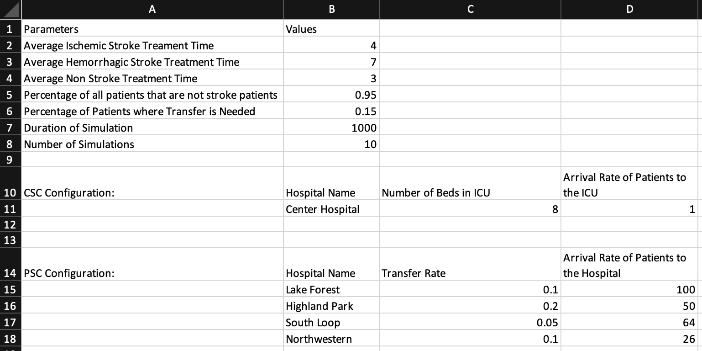

# Simulation Instructions

## Installation

- The simulation requires the usage of `Python 3`
- Installation instructions for `Python 3` can be found at: https://www.python.org/downloads/
- This simulation was developed on `Python 3.6.5`. YMMV with regards to newer versions, although newer versions should work the same way as far as I am aware.

In addition to the usage of `Python 3`, there are a few packages required within Python that need to be installed. These packages include:

- Numpy
- Matplotlib

These should be installed via the `pip3` command as follows:

`$ pip3 install numpy`

`$ pip3 install matplotlib`

Here, the `$` denotes a terminal instance. These installation instructions are for a Unix based system.

## Usage

Once `Python 3` and the proper dependencies are installed, we can now run the simulation. Opening the config file (presumably in `Excel`) will present you with a file that looks like this:

**WARNING** *Do not change the names of the parameters or any headers*

**THE SIMULATION WILL NOT WORK IF THE CONFIG FILE CHANGES FORM**

Simply change values as needed. To add additional PSC hospitals to the configuration, simply add more rows underneath the PSC configuration section. (e.g. Adding the hospital 'University of Chicago' underneath 'Northwestern')

## Assumptions

The model assumes that the PSC does not transfer non stroke patients to the CSC. This is a naive assumption, and is subject to change. 
